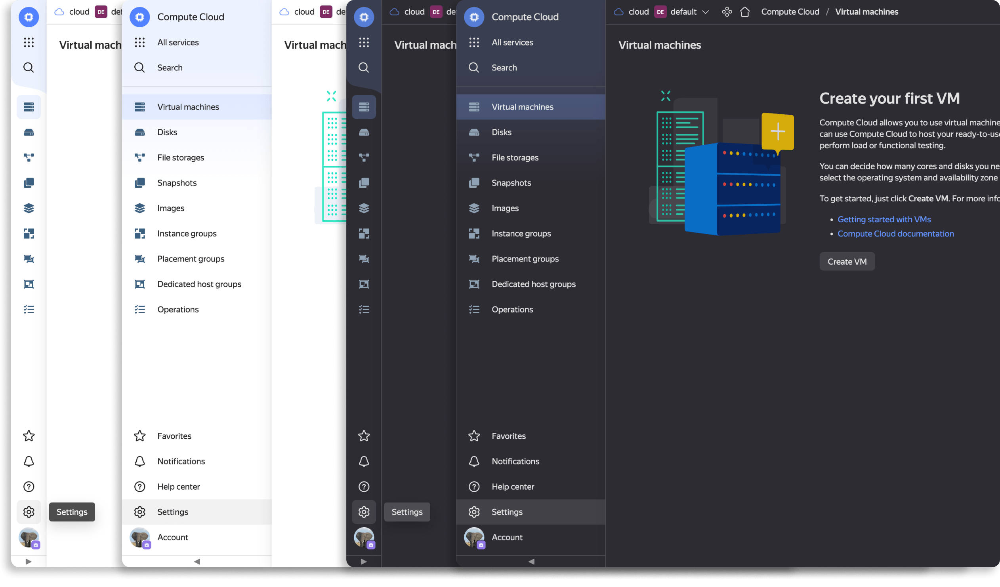

# @gravity-ui/navigation &middot; [](https://www.npmjs.com/package/@gravity-ui/navigation) [](https://github.com/gravity-ui/navigation/actions/workflows/ci.yml?query=branch:main) [](https://preview.gravity-ui.com/navigation/)

### Aside Header Navigation &middot; [Preview →](https://preview.yandexcloud.dev/navigation/)



## Install

```bash
npm install @gravity-ui/navigation
```

Ensure that peer dependencies are installed in your project

```bash
npm install --dev @gravity-ui/uikit@^7.2.0 @gravity-ui/icons@^2.2.0 @bem-react/classname@^1.6.0 react@^19.0.0 react-dom@^19.0.0
```

## Usage

Render `AsideHeader` as the app shell. It is a controlled component — you own the collapsed state via `compact`/`onChangeCompact` — and your page content goes through `renderContent`. Set up `@gravity-ui/uikit` styles and `ThemeProvider` first (see the [uikit styles guide](https://github.com/gravity-ui/uikit?tab=readme-ov-file#styles)).

```tsx
import React from 'react';
import {AsideHeader} from '@gravity-ui/navigation';
import {Gear, House} from '@gravity-ui/icons';
import {ThemeProvider} from '@gravity-ui/uikit';

import '@gravity-ui/uikit/styles/styles.css';

export function App() {
  const [compact, setCompact] = React.useState(false);

  return (
    <ThemeProvider theme="light">
      <AsideHeader
        logo={{text: 'My App', href: '/'}}
        compact={compact}
        onChangeCompact={setCompact}
        menuItems={[
          {id: 'home', title: 'Home', icon: House, current: true},
          {id: 'settings', title: 'Settings', icon: Gear},
        ]}
        renderContent={() => <main>Page content</main>}
      />
    </ThemeProvider>
  );
}
```

## Sandboxes

Basic
https://codesandbox.io/p/devbox/navigation-demo-simple-x9k5sd

Advanced
https://codesandbox.io/p/devbox/recursing-dawn-6kc9vh

## Roadmap 2025

1. Support SSR
2. Add more docs, examples to [Gravity UI](https://gravity-ui.com/ru/components/navigation/aside-header)
3. Support Navigation at UIKit themer
4. Unify subheaderItem, menuItem, footerItem API

## Components

- [AsideHeader](https://github.com/gravity-ui/navigation/tree/main/src/components/AsideHeader/README.md)
  - [AllPagesPanel](https://github.com/gravity-ui/navigation/tree/main/src/components/AllPagesPanel/README.md)
  - PageLayout
- [PageLayoutAside](https://github.com/gravity-ui/navigation/tree/main/src/components/AsideHeader/README.md)
- AsideFallback
- FooterItem
- [Logo](https://github.com/gravity-ui/navigation/tree/main/src/components/Logo/Readme.md)
- [Drawer](https://github.com/gravity-ui/navigation/tree/main/src/components/Drawer/README.md)
- [DrawerItem](https://github.com/gravity-ui/navigation/blob/main/src/components/Drawer/README.md#draweritem-props)
- [MobileHeader](https://github.com/gravity-ui/navigation/tree/main/src/components/MobileHeader/README.md)
- MobileHeaderFooterItem
- MobileLogo
- [HotkeysPanel](https://github.com/gravity-ui/navigation/tree/main/src/components/HotkeysPanel/README.md)
- [Footer](https://github.com/gravity-ui/navigation/tree/main/src/components/Footer/README.md)
- [MobileFooter](https://github.com/gravity-ui/navigation/tree/main/src/components/Footer/README.md)
- [ActionBar](https://github.com/gravity-ui/navigation/tree/main/src/components/ActionBar/README.md)
- [Settings](https://github.com/gravity-ui/navigation/tree/main/src/components/Settings/README.md)

## CSS API

Used for themization Navigation's components

## License

Distributed under the MIT License. See [LICENSE](LICENSE) for details.

## For AI agents

Application-shell navigation components for Gravity UI apps — the collapsible `AsideHeader` sidebar plus footers, drawers, logo, hotkeys and settings panels that frame a whole page.

### When to use

- The app's primary navigation frame: `AsideHeader` (collapsible side navigation) with `menuItems`, subheader, and footer sections.
- Supporting shell UI: `Drawer`/`DrawerItem`, `Footer`/`MobileFooter`, `MobileHeader`, `HotkeysPanel`, `Settings`, `ActionBar`, `Logo`.
- Laying out page content inside the navigation frame via `renderContent` / `PageLayout`.

### When not to use

- Generic in-page controls (buttons, tabs, menus, breadcrumbs) — use [`@gravity-ui/uikit`](https://github.com/gravity-ui/uikit); this package is the outer app chrome, not general components.
- Rendering the page body itself from config — use [`@gravity-ui/page-constructor`](https://github.com/gravity-ui/page-constructor).
- Client-side routing — this provides the navigation UI only; wire clicks to your own router.

### Common pitfalls

- **`AsideHeader` is controlled.** You must own the collapsed state with `compact` and update it in `onChangeCompact`; passing `compact` without the handler freezes the sidebar.
- **Menu items are `menuItems`, keyed by `id`.** Each item is `{id, title, icon, current, onItemClick}`; `icon` takes an icon component (e.g. from `@gravity-ui/icons`), not a string name.
- **Peer dependencies are required.** `@gravity-ui/uikit`, `@gravity-ui/icons`, and `@bem-react/classname` must be installed alongside `react`/`react-dom`.
- **Needs uikit setup.** Render inside `ThemeProvider` and import `@gravity-ui/uikit/styles/styles.css`, or the shell renders unstyled.
- **Page content goes through `renderContent`.** Render your routed content via the `renderContent` prop / `PageLayout`, not as `children`.
