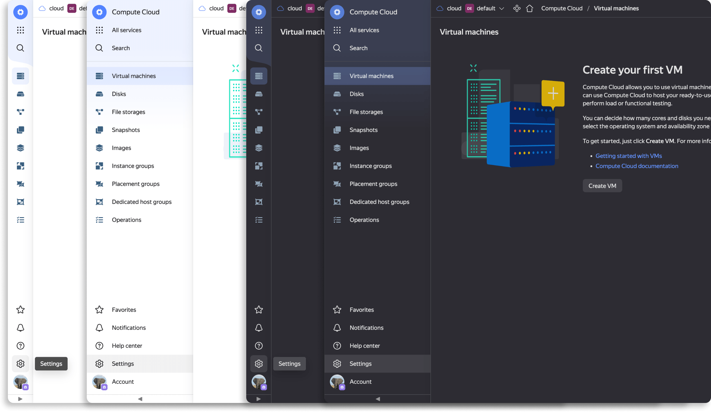

# @gravity-ui/navigation &middot; [](https://www.npmjs.com/package/@gravity-ui/navigation) [](https://github.com/gravity-ui/navigation/actions/workflows/ci.yml?query=branch:main) [](https://preview.yandexcloud.dev/navigation/)

### Aside Header Navigation &middot; [Preview →](https://preview.yandexcloud.dev/navigation/)



## Install

```bash
npm install @gravity-ui/navigation
```

Ensure that peer dependencies are installed in your project

```bash
npm install --dev @gravity-ui/uikit@^3.0.2 @bem-react/classname@1.6.0 react@^16.0.0
```

## Components

- AsideHeader
- MobileHeader
- FooterItem
- MobileHeaderFooterItem
- Drawer
- DrawerItem
- PageLayout

## Optimization
If your app content needs to be rendered faster than by passing it throw `AsideHeader` props,
you may need to switch usage of `AsideHeader` to advanced style with `PageLayout` like this:

```diff
-import {AsideHeader} from '@gravity-ui/navigation';
+import {PageLayout} from '@gravity-ui/navigation';
+
+const PageLayoutAside = React.lazy(
+    import('@gravity-ui/navigation').then((module) => ({default: module.PageLayoutAside})),
+);

-    <AsideHeader renderContent={renderContent} {...restProps} />
+    <PageLayout reverse>
+        <PageLayout.Content>
+            <ContentExample />
+        </PageLayout.Content>
+
+        <Suspense fallback={null}>
+            <PageLayoutAside {...restProps} />
+        </Suspense>
+    </PageLayout>
```


## Imports

```ts
import {AsideHeader} from '@gravity-ui/navigation';
```

## CSS variables

Used for themization Navigation's components

### AsideHeader vars

| Name                                                   | Description                                                      | Default                                                                           |
| :----------------------------------------------------- | :--------------------------------------------------------------- | :-------------------------------------------------------------------------------- |
| `--gn-aside-header-background-color`                   | Сolor of decorations and selected items                          | `--g-color-base-warning-light`                                                    |
| `--gn-aside-header-subheader-divider-line-color`       | Divider line color for withDecoration and expanded `AsideHeader` | Light theme: `--g-color-line-generic`, Dark theme: `--g-color-line-generic-solid` |
| `--gn-aside-header-collapse-button-divider-line-color` |                                                                  | `--gn-aside-header-subheader-divider-line-color`                                  |
| `--gn-aside-header-footer-item-icon-color`             |                                                                  | `--g-color-text-primary`                                                          |
| `--gn-aside-header-subheader-item-icon-color`          |                                                                  | `--g-color-text-primary`                                                          |
| `--gn-aside-header-item-icon-background-size`          | Background size used when `AsideHeader` is compact               | `38px`                                                                            |
| `--gn-aside-header-divider-line-color`                 | Vertical color divider between `AsideHeader` and content         | Light theme: `transparent`, Dark theme: `--g-color-line-generic-solid`            |
